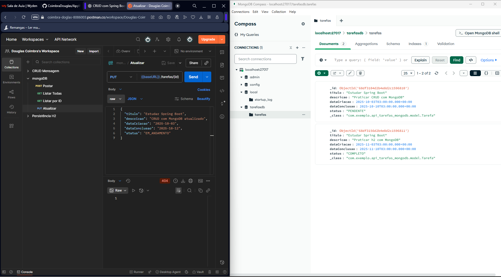

# 📝 Projeto: API REST para Gerenciamento de Tarefas (Spring Boot + MongoDB)

## 📌 Descrição
Este projeto é uma API RESTful desenvolvida com **Spring Boot** e **MongoDB** para gerenciar tarefas.  
O sistema permite operações básicas de **CRUD** (Create, Read, Update, Delete) sobre tarefas armazenadas em um banco de dados NoSQL.  

Cada tarefa contém os seguintes campos:
- `id`: identificador único (gerado automaticamente)
- `titulo`: título da tarefa
- `descricao`: descrição detalhada
- `dataCriacao`: data em que a tarefa foi criada
- `dataConclusao`: data prevista para conclusão
- `status`: PENDENTE, EM_ANDAMENTO, CONCLUIDA

---

## ⚙️ Tecnologias Utilizadas
- Java 17+
- Spring Boot 3+
- Spring Web
- Spring Data MongoDB
- MongoDB Community Server

---

## 📋 Pré-requisitos
Antes de executar o projeto, certifique-se de ter instalado:
- [Java JDK 17+](https://www.oracle.com/java/technologies/javase-downloads.html)
- [Maven](https://maven.apache.org/download.cgi)
- [MongoDB Community Server] (https://www.mongodb.com/try/download/community)
- IDE (Visual Studio Code, IntelliJ, Eclipse, etc.)

---

## 🛠️ Como instalar e rodar o MongoDB no Windows

### **Opção A — Instalar como serviço**
Durante a instalação do MongoDB, selecione a opção para instalar como serviço.  
Após isso, o MongoDB iniciará automaticamente no Windows.  
Para verificar, abra **Windows Services** e procure por *MongoDB*.  

### **Opção B — Rodar manualmente**
1. Abra o **Prompt de Comando** ou PowerShell.  
2. Navegue até a pasta onde o MongoDB foi instalado, exemplo:
```powershell
cd "C:\Program Files\MongoDB\Server\6.0\bin"
```
Crie a pasta de dados, se não existir:

```powershell

mkdir C:\data\db
```
Execute o MongoDB:

``` powershell

mongod
```
Agora o MongoDB estará rodando na porta padrão 27017.

Testar conexão
Abra outro terminal e digite:

```powershell

mongo
```
Se abrir o shell do MongoDB, a instalação está correta.

---

## 🚀 Como rodar o projeto

Clone o repositório:

```bash

git clone https://github.com/CoimbraDouglas/AppWeb_BDNoSQL.git
cd api-tarefas-mongodb
```
Rodar a aplicação:

```bash

./mvnw spring-boot:run
```
ou

```bash
mvn spring-boot:run
```

A API estará disponível em:
```
http://localhost:8080
```

---

## 📡 Endpoints da API

**➕ Criar tarefa**

* POST /tarefas

```json

{
  "titulo": "Estudar Spring Boot",
  "descricao": "Praticar CRUD com MongoDB",
  "dataCriacao": "2025-10-03",
  "dataConclusao": "2025-10-10",
  "status": "PENDENTE"
}
```
**📋 Listar todas as tarefas**

* GET /tarefas

**🔍 Buscar tarefa por ID**

* GET /tarefas/{id}

**✏️ Atualizar tarefa**

* PUT /tarefas/{id}

Body (JSON):

```json

{
  "titulo": "Estudar Spring Boot",
  "descricao": "CRUD com MongoDB atualizado",
  "dataCriacao": "2025-10-03",
  "dataConclusao": "2025-10-12",
  "status": "EM_ANDAMENTO"
}
```

**❌ Deletar tarefa**

* DELETE /tarefas/{id}

---

## 🗄️ Configuração do MongoDB no Spring Boot
No arquivo src/main/resources/application.properties:

```
spring.data.mongodb.host=localhost
spring.data.mongodb.port=27017
spring.data.mongodb.database=tarefasdb
```

---

## 📌 Observações
O MongoDB deve estar rodando antes de iniciar a aplicação Spring Boot.

O campo status deve conter apenas: PENDENTE, EM_ANDAMENTO ou CONCLUIDA.

Em produção, considere usar autenticação e configuração segura para o MongoDB.

---

## 📁 Estrutura do projeto

```bash
api-tarefas-mongodb/
├── src/
│   ├── main/
│   │   ├── java/com/exemplo/apitarefasmongodb/
│   │   │   ├── controller/TarefaController.java
│   │   │   ├── model/Tarefa.java
│   │   │   ├── repository/TarefaRepository.java
│   │   │   ├── service/TarefaService.java
│   │   │   └── ApiTarefasMongodbApplication.java
│   │   └── resources/application.properties
├── README.md
├── pom.xml
```
---

## 📸 Projeto em execução

Exemplo de execução usando Postman:



---

## 📋 Detalhes do Projeto

📚 **Disciplina:** Arquitetura de Aplicacoes Web 
👨‍🏫 **Professor:** Leonardo Vieira Guimarãe 
🏫 **Instituição:** Centro Universitário Newton Paiva 
✍️ **Aluno:** Douglas Coimbra Laass.
